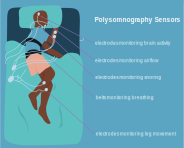

```{r setup, include=FALSE}
knitr::opts_chunk$set(echo = TRUE)
```


```{r logo,fig.align='center', echo=FALSE}
knitr::include_graphics("images/Questionnaire_header_long.svg")
```

<br><br> <br><!-- Add two line breaks -->

#  Research Study Information Sheets
 

<br><br> <br><!-- Add two line breaks -->

  

##  Polysomnography Information

Thank you for participating in our research study.  This information sheet will give you full details of what will happen during the polysomnography (PSG) test.  The purpose of PSG is to examine your circadian rhythms and sleep patterns by monitoring changes in your breathing, brain and muscle activity while you sleep.  A trained researcher will visit you at home to fit sensors that will monitor your brain waves, eye movements, heart rate, breathing pattern, blood oxygen levels, body positioning and movement, snoring while you sleep.  

Polysomnography is a non-invasive, painless procedure that is often carried out in sleep research centre and hospital clinics.  The only potential side effect is mild skin irritation caused by the adhesives used to attach test sensors onto the skin.  
&nbsp;  

<center>  
  
</center>  

<br>  

####   What you need to do?  
You will need to avoid napping in the afternoon before the sleep study or doing anything that might affect your sleep that night.  You must not drink alcohol or eat or drink anything with caffeine during the afternoon and evening before the sleep study.  You will need to be able to sleep uninterrupted by pets, partners or children for the duration of the test (approximately 8-9 hours, or your usual sleep duration).  

&nbsp;  

####   What will happen on the evening of your PSG? 
The researchers will arrive at your house about 1 hour before your normal sleep time.  They will fit the sensors and set up the system to record automatically.  You will not need to take any action.  You can sleep in your usual night clothes as long as these don’t interfere with any of the sensors.   

Electrodes will be placed on your scalp, temples, chest and legs and will be attached to you using a mild adhesive and connected by wires to a control unit.  This is a small computer that is worn on a strap around the chest.  A small clip will be placed on your finger to monitor oxygen levels in your blood, and your breathing will be monitored by a plastic tube in your nostrils. Elastic belts will be placed around your chest and belly to measure your inhaled and exhaled breaths.  

You will still be able to move normally in bed and if you need to get up during the night, this is no problem as long as you are careful not to rip off any of the sensors.  It is possible you won't fall asleep easily or sleep as well as usual, but this is normal and we can still retrieve data from the test.  In the morning, you can remove the sensors and wires yourself and place them in the box ready for collection by the researchers.  

Your bedroom needs to be dark and quiet and it is very important that you wear your wrist strap sensor and that your bedside sensor is present and plugged in during the PSG test.  

&nbsp;  

####  What happens next?  
When we receive the equipment back at our laboratory, we will analyse your results.  We will not return the results of the polysomnography test to you unless we consider that the data do not reflect a normal sleep pattern.  In this case you will be withdrawn from the study, and we will send you and your GP a copy of your data.  

&nbsp;  

If you have any problems or questions, you can always contact the research team:  
    AmbientBD@mu.ie or 087 199 8589. 
&nbsp; 


<div align="center"> **Thank you very much for your support with our research** </div>
       
